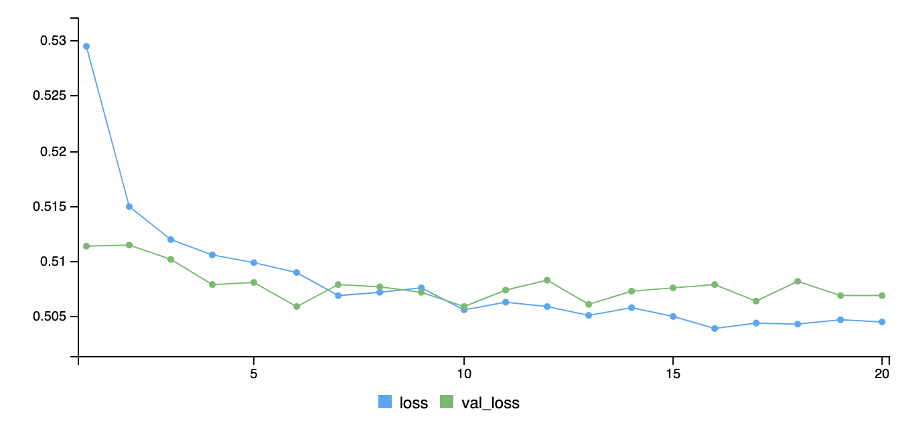
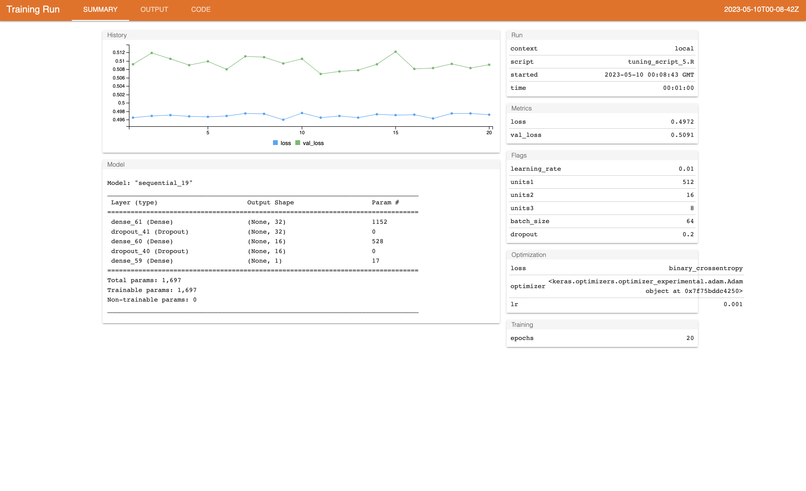
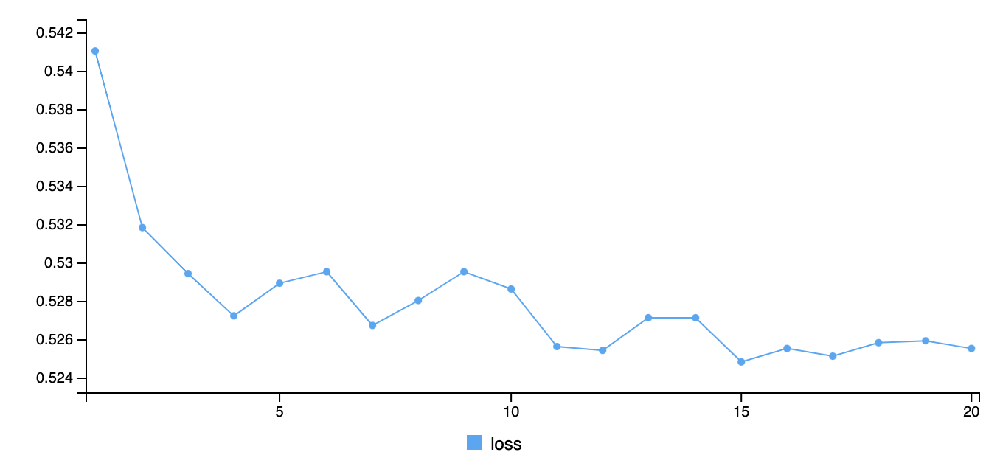

# Load diabetes data csv 
```{r}
diabetes_data = read.csv("diabetes_binary.csv")
```

# Check dataframe details with variables list
```{r}
str(diabetes_data)
```
# Convert categorical variable in fators
```{r}
cols_skip <- c('BMI', 'GenHlth', 'MentHlth', 'PhysHlth', 'Age', 'Education', 'Income')
cols_skip_indices <- which(names(diabetes_data) %in% cols_skip)
diabetes_data[, -cols_skip_indices] <- lapply(diabetes_data[, -cols_skip_indices], factor)
str(diabetes_data)
```

# Check diabetes dataset summary
```{r}
summary(diabetes_data)
```
# Check Diabetes data is balanced or imbalanced

```{r}
proportions(table(diabetes_data$Diabetes_binary))
```


```{r}
pie(proportions(table(diabetes_data$Diabetes_binary)), labels = c('Non-Diabetes', 'Diabetes'), col = c('green', 'red'))
```


In the above observation, we can see that the diabetes data is balanced. Data is distributed equally in both non-diabetic and diabetic data (50% each).


# Display list of categorical and numerical variables
```{r}
numerical_variables <- array(, dim = c(0))
categorical_variables <- array(, dim = c(0))

for (c in colnames(diabetes_data)) 
{
  if (is.numeric(diabetes_data[,c])){
      numerical_variables <- c(numerical_variables, c)
  } else if (is.factor(diabetes_data[,c])){
    categorical_variables <- c(categorical_variables, c)
  }
}
cat("Categorical variables:", categorical_variables, "\n","\n")
cat("Numerical variables:", numerical_variables, "\n")
```
# Check is there any missing attributes in dataset.
```{r}
missing_counts <- colSums(is.na(diabetes_data))

cat("Missing Counts in each columns:", "\n")
print(missing_counts)
```


# Use statistical test and plots to find relations between diabetes and other variables. Also removing variables from the dataset which have very weak relation with diabetes variables.
```{r}
diabetes_indices <- which(names(diabetes_data)=='Diabetes_binary')
for (c in colnames(diabetes_data[, -diabetes_indices])) 
{
  if (is.factor(diabetes_data[,c])){
    try({
       pvalue = chisq.test(diabetes_data$Diabetes_binary, diabetes_data[,c])
       cat('pvalue of the chi-square test b/w',c,"and Diabetes is:", pvalue$p.value, '\n')
       mosaicplot(diabetes_data$Diabetes_binary~diabetes_data[,c], shade=TRUE, main=paste("Mosaic Plot of Diabetes vs", c), xlab="Diabetes", ylab=c, las=1) 
    })
  }
  else if (is.numeric(diabetes_data[,c])){
    try({
      pvalue = oneway.test(diabetes_data[,c]~diabetes_data$Diabetes_binary)
      cat('pvalue of the oneway test b/w',c,"and Diabetes is:", pvalue$p.value, '\n')
      boxplot(diabetes_data$Diabetes_binary, diabetes_data[,c], col = '#69b3a2', xlab="Diabetes", ylab=c, main=paste("Box Plot of Diabetes vs", c))
    })
  }
  if (pvalue$p.value > 0.05) {
    housing_data[[c]] <- NULL
    cat('\n', 'Removing',c,"from dataset as it's p-value is greater than 0.05:", pvalue$p.value, '\n')
  }
}
```


# After Statistical test to check the relations between diabetes and other variable and removal of non-related varibale, checking the dataset.
```{r}
str(diabetes_data)
```
# Partition dataset in training and test data using caret function.

```{r}
library(caret)

partition_indices = createDataPartition(diabetes_data$Diabetes_binary, p=0.8, list = FALSE)

diabetes_train_data = diabetes_data[partition_indices, ]
diabetes_train_data
diabetes_test_data = diabetes_data[-partition_indices, ]
diabetes_test_data
true_labels = diabetes_test_data$Diabetes_binary
```

# Training and testing knn model using overscalling data using smote sampling in train control function.

```{r}
library(caret)

trainControl <- trainControl(method = "cv", number = 5)
knn_model <- train(Diabetes_binary ~ ., data = diabetes_train_data, method = "knn", trControl = trainControl)

```

```{r}
knn_predictions <- predict(knn_model, newdata = diabetes_test_data)
```


```{r}
knn_confusion_matrix_class0 <- confusionMatrix(knn_predictions, true_labels, mode='everything')
print(knn_confusion_matrix_class0)
```

```{r}
knn_confusion_matrix_class1 <- confusionMatrix(knn_predictions, true_labels, positive = '1', mode='everything')
print(knn_confusion_matrix_class1)
```


# Lasso model
```{r}
library(glmnet)
library(caret)
set.seed(1)
tr = trainControl(method = "cv", number = 5, preProc = "nzv")
tg = expand.grid(alpha = 1, lambda = 10^seq(-4, -2, length =100))
lasso_model <- train(Diabetes_binary ~ ., data = diabetes_train_data, method = "glmnet", trControl = tr, tuneGrid = tg)
lasso_model
```


```{r}
lasso_predictions <- predict(lasso_model, newdata = diabetes_test_data, na.action = na.pass)
```


```{r}
lasso_confusion_matrix_class0 <- confusionMatrix(lasso_predictions, true_labels, mode='everything')
print(lasso_confusion_matrix_class0)
cat("\n\n")
```


```{r}
lasso_confusion_matrix_class1 <- confusionMatrix(lasso_predictions, true_labels, mode='everything', positive='1')
print(lasso_confusion_matrix_class1)
cat("\n\n")
```

# Ridge Model 

```{r}
library(glmnet)
library(caret)

set.seed(1)
tr = trainControl(method = "cv", number = 5, preProc = "nzv")
tg = expand.grid(alpha = 0, lambda = 10^seq(-3, -1, length =100))
ridge_model <- train(Diabetes_binary ~ ., data = diabetes_train_data, method = "glmnet", trControl = tr, tuneGrid = tg)
ridge_model
```

```{r}
ridge_predictions <- predict(ridge_model, newdata = diabetes_test_data, na.action = na.pass)
```


```{r}
ridge_confusion_matrix_class0 <- confusionMatrix(ridge_predictions, true_labels, mode='everything')
print(ridge_confusion_matrix_class0)
cat("\n\n")
```


```{r}
ridge_confusion_matrix_class1 <- confusionMatrix(ridge_predictions, true_labels, mode='everything', positive='1')
print(ridge_confusion_matrix_class1)
cat("\n\n")
```


# Elastic Net Model
```{r}
library(glmnet)
library(caret)

set.seed(1)
tr = trainControl(method = "cv", number = 5, preProc = "nzv")
tg = expand.grid(alpha =seq(0, 1, length=10), lambda = 10^seq(-3, 1, length = 100))
enet_model <- train(Diabetes_binary ~ ., data = diabetes_train_data, method = "glmnet", trControl = tr, tuneGrid = tg)
enet_model
```

```{r}
enet_predictions <- predict(enet_model, newdata = diabetes_test_data, na.action = na.pass)
```


```{r}
enet_confusion_matrix_class0 <- confusionMatrix(enet_predictions, true_labels, mode='everything')
print(enet_confusion_matrix_class0)
cat("\n\n")
```


```{r}
enet_confusion_matrix_class1 <- confusionMatrix(enet_predictions, true_labels, mode='everything', positive='1')
print(enet_confusion_matrix_class1)
cat("\n\n")
```


# Random Forest Model
```{r}
library(caret)
set.seed(1)
tr = trainControl(method = "cv", number = 5, preProc = "nzv")
rf_model <- train(Diabetes_binary ~ ., data = diabetes_train_data, method = "rf", trControl = tr, importance = TRUE)
rf_model
```

```{r}
varImp(rf_model)
```

```{r}
rf_predictions <- predict(rf_model, newdata = diabetes_test_data, na.action = na.pass)
```

```{r}
rf_confusion_matrix_class0 <- confusionMatrix(rf_predictions, true_labels, mode='everything')
print(rf_confusion_matrix_class0)
cat("\n\n")
```
```{r}
rf_confusion_matrix_class1 <- confusionMatrix(rf_predictions, true_labels, mode='everything', positive='1')
print(rf_confusion_matrix_class1)
cat("\n\n")
```


# GBM without sampling

```{r}
library(caret)
set.seed(1)
tr = trainControl(method = "cv", number = 5, preProc = "nzv")
gbm_model <- train(Diabetes_binary ~ ., data = diabetes_train_data, method = "gbm", trControl = tr)
gbm_model
```

```{r}
gbm_predictions <- predict(gbm_model, newdata = diabetes_test_data, na.action = na.pass)
```

```{r}
gbm_confusion_matrix_class0 <- confusionMatrix(gbm_predictions, true_labels, mode='everything')
print(gbm_confusion_matrix_class0)
cat("\n\n")
```

```{r}
gbm_confusion_matrix_class1 <- confusionMatrix(gbm_predictions, true_labels, mode='everything', positive='1')
print(gbm_confusion_matrix_class1)
cat("\n\n")
```


# SVM Linear Model

```{r}
library(caret)
set.seed(1)
tr = trainControl(method = "cv", number = 5, preProc = "nzv")
svm_linear_model <- train(Diabetes_binary ~ ., data = diabetes_train_data, method = "svmLinear", trControl = tr)
svm_linear_model
```

```{r}
svm_linear_predictions <- predict(svm_linear_model, newdata = diabetes_test_data, na.action = na.pass)
```

```{r}
svm_linear_confusion_matrix_class0 <- confusionMatrix(svm_linear_predictions, true_labels, mode='everything')
print(svm_linear_confusion_matrix_class0)
cat("\n\n")
```

```{r}
svm_linear_confusion_matrix_class1 <- confusionMatrix(svm_linear_predictions, true_labels, mode='everything', positive='1')
print(svm_linear_confusion_matrix_class1)
cat("\n\n")
```


# SVM Radial Model

```{r}
library(caret)
set.seed(1)
tr = trainControl(method = "cv", number = 5, preProc = "nzv")
svm_radial_model <- train(Diabetes_binary ~ ., data = diabetes_train_data, method = "svmRadial", trControl = tr)
svm_radial_model
```

```{r}
svm_radial_predictions <- predict(svm_radial_model, newdata = diabetes_test_data, na.action = na.pass)
```

```{r}
svm_radial_confusion_matrix_class0 <- confusionMatrix(svm_radial_predictions, true_labels, mode='everything')
print(svm_radial_confusion_matrix_class0)
cat("\n\n")
```

```{r}
svm_radial_confusion_matrix_class1 <- confusionMatrix(svm_radial_predictions, true_labels, mode='everything', positive='1')
print(svm_radial_confusion_matrix_class1)
cat("\n\n")
```


# Compare all the sampled models
```{r}
compare=resamples(list(KNN= knn_model, Lasso=lasso_model, Ridge=ridge_model, Enet=enet_model, RF=rf_model, GBM=gbm_model, SVML=svm_linear_model, SVMR=svm_radial_model))
summary(compare)
```

# Preprocessing for nueral network
```{r}
library(caret)

parti_indices = createDataPartition(diabetes_train_data$Diabetes_binary, p=0.9, list = FALSE)
diabetes_index <- which(names(diabetes_train_data)=='Diabetes_binary')

diabetes_train_data1 = diabetes_train_data[parti_indices, -diabetes_index]
diabetes_train_data1
training_labels = diabetes_train_data[parti_indices, diabetes_index]
training_labels <- as.numeric(training_labels) - 1
training_labels
diabetes_validation_data = diabetes_train_data[-parti_indices, -diabetes_index]
diabetes_validation_data
validation_labels = diabetes_train_data[-parti_indices, diabetes_index]
validation_labels <- as.numeric(validation_labels) - 1
validation_labels
diabetes_testing_data = diabetes_test_data[, -diabetes_index]
diabetes_testing_data
test_labels = as.numeric(diabetes_test_data[,diabetes_index]) - 1
test_labels
```

```{r}
library(caret)

str(diabetes_train_data1)
preproc <- preProcess(diabetes_train_data1, method = c("center", "scale"))

train_imputed <- predict(preproc, diabetes_train_data1)

str(train_imputed)
train_imputed
test_imputed <- predict(preproc, diabetes_testing_data)
test_imputed
val_imputed <- predict(preproc, diabetes_validation_data)
val_imputed
```


```{r}
library(data.table)
library(mltools)

train_encoded <- one_hot(as.data.table(train_imputed), dropUnusedLevels = FALSE)
train_encoded
test_encoded <- one_hot(as.data.table(test_imputed), dropUnusedLevels = FALSE)
test_encoded
val_encoded <- one_hot(as.data.table(val_imputed), dropUnusedLevels = FALSE)
val_encoded
```

```{r}
nzv_indices <- nearZeroVar(train_encoded, saveMetrics= TRUE)

train_encoded_nzv <- train_encoded[,-nzv_indices]
val_encoded_nzv <- val_encoded[,-nzv_indices]
test_encoded_nzv <- test_encoded[,-nzv_indices]
train_encoded
val_encoded
test_encoded
```

```{r}
library(keras)

model <- keras_model_sequential() %>%
  layer_dense(units = 32, activation = "relu", input_shape = dim(train_encoded)[2]) %>%
  layer_dropout(rate = 0.2) %>%
  layer_dense(units = 16, activation = "relu") %>%
  layer_dropout(rate = 0.2) %>%
  layer_dense(units = 1, activation = "sigmoid")

model %>% compile(
  loss = "binary_crossentropy",
  optimizer = "adam"
)
 
history <- model %>% fit(as.matrix(train_encoded), training_labels,
  epochs = 20,
  batch_size = 20, verbose=2,
  validation_data = list(as.matrix(val_encoded), validation_labels)
)

```

```{r}

```

```{r}
predictions <- model %>% predict(as.matrix(test_encoded))
```


```{r}
predicted_labels <- as.factor(ifelse(predictions <= 0.5, 0, 1)[,1])
confusion_matrix_class0 <- confusionMatrix(predicted_labels, as.factor(test_labels), mode='everything')
print(confusion_matrix_class0)
```


```{r}
confusion_matrix_class1 <- confusionMatrix(predicted_labels, as.factor(test_labels), mode='everything', positive='1')
print(confusion_matrix_class1)
```


```{r}
library(keras)
library(tfruns)

runs= tuning_run("tuning_script_5.R",
                 flags=list(
                 learning_rate=c(0.1, 0.5, 0.01, 0.001),
                 units1=c(8, 16, 32, 64, 128, 512),
                 units2=c(8, 16, 32, 64, 128),
                 units2=c(8, 16, 32, 64, 128),
                 batch_size=c(8,16, 32, 64),
                 dropout=c(0.1, 0.2, 0.3, 0.4, 0.5)
                 ),
                 sample= 0.001
)
```

```{r}
view_run(runs$run_dir[1])
```
```{r}

```

```{r}
if (runs[1, ]$metric_loss > runs[1, ]$metric_val_loss) {
  print("The model doesn't overfit.")
} else {
  print("The model overfits.")
}

```


```{r}
library(keras)
library(tfruns)

best_model <- keras_model_sequential() %>%
  layer_dense(units = 512, activation = "relu", input_shape = dim(train_encoded)[2]) %>%
  layer_dropout(rate = 0.2) %>%
  layer_dense(units = 16, activation = "relu") %>%
  layer_dropout(rate = 0.2) %>%
  layer_dense(units = 8, activation = "relu") %>%
  layer_dropout(rate = 0.2) %>%
  layer_dense(units = 1, activation = "sigmoid")

opt= optimizer_adam(learning_rate=0.01)
best_model %>% compile(
  loss = "binary_crossentropy",
  optimizer = opt)

combined_train_x= rbind(train_encoded, val_encoded)
combined_train_y= c(training_labels, validation_labels)

history <- best_model %>% fit(as.matrix(combined_train_x),
                         combined_train_y,
                         batch_size=64,
                         epochs = 20, verbose=2)
```

```{r}
best_model_predictions <- best_model %>% predict(as.matrix(test_encoded))
```


```{r}
predicted_labels <- as.factor(ifelse(best_model_predictions <= 0.5, 0, 1)[,1])
confusion_matrix_class0 <- confusionMatrix(predicted_labels, as.factor(test_labels), mode='everything')
print(confusion_matrix_class0)
```
```{r}
confusion_matrix_class1 <- confusionMatrix(predicted_labels, as.factor(test_labels), mode='everything', positive='1')
print(confusion_matrix_class1)
```

```{r}

```


